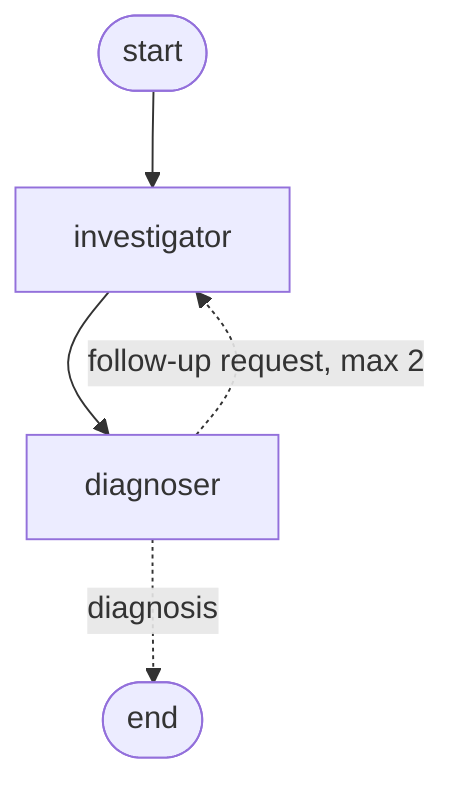

# ml-debug-agent

LLM agents that diagnose what went wrong in a machine learning training run, using only
what an engineer would see in the experiment tracker: the logged config, per-epoch
metrics, and the train/validation split.

The project builds a labeled benchmark of deliberately broken training runs, then
compares three diagnosers on it: a hand-written rule baseline, a single tool-using agent,
and a two-agent LangGraph system in which a diagnoser can ask an investigator for more
evidence.

**Stack:** PyTorch · MLflow · LangChain · LangGraph · Pydantic · Ollama / Gemini · pytest · uv

## How it works

```
 train.py ──► MLflow ──► mlflow_access.py ──► tools.py ──► agent ──► Diagnosis ──► eval harness
 (inject a    (runs,     (the only code that  (measurements,  (single or       (validated   (accuracy,
  known bug)   metrics)   reads MLflow; hides  no conclusions)  two-agent)       Pydantic     confusion
                          the answer)                                            model)       matrix)
```

### 1. A benchmark with known answers

A small MLP is trained on Fashion-MNIST (10 classes). Each bug is a set of config changes
from a healthy run:

| Bug | What is changed |
|---|---|
| `none` | nothing (healthy control) |
| `lr_too_high` | learning rate 0.5, about 500x normal |
| `overfit` | 500 training examples, no dropout or weight decay, 30 epochs |
| `label_shuffle` | training labels randomly permuted |
| `leakage` | the validation set copied into the training set |
| `unnormalized` | raw 0-255 pixels instead of normalized inputs |

`benchmark-v1` contains **30 runs: 6 bug types x 5 seeds**, with small variations in the
healthy settings so runs of the same bug don't look identical. Every run logs its config,
per-epoch losses, accuracies and gradient norms, and its split indices to MLflow.

### 2. Keeping the answer hidden

The true bug is stored in each run's name, description and an `eval.true_bug` tag.
[`mlflow_access.py`](src/ml_debug_agent/agents/mlflow_access.py) is the only module that
reads MLflow. Agents see runs through `get_run_view()`, which uses an **allowlist** of
fields, so the parameters that *are* the bug (`label_noise`, `leak_val_into_train`) are
never exposed. Only the eval harness may call `get_true_bug()`.

### 3. Tools

[`tools.py`](src/ml_debug_agent/agents/tools.py) gives the agents four tools:
`summarize_curves`, `get_config`, `check_split_overlap` and `get_metric_history`.
Code does the arithmetic, since LLMs are unreliable at maths over long lists of numbers,
and the run ID is fixed in code, so the model can't mistype it or inspect other runs.
Tools return **measurements, never conclusions**.

### 4. A fair comparison

Prompts and tool descriptions define what each label means, but never describe symptoms
or thresholds. Otherwise the agent would just be the baseline's rules written in English.
A test scans every prompt and tool description for give-away terms.

### 5. The diagnosers

- **Rule baseline** ([`baseline.py`](src/ml_debug_agent/eval/baseline.py)): hand-written
  if-statements over the same tool outputs.
- **Single agent** ([`single_agent.py`](src/ml_debug_agent/agents/single_agent.py)): a
  tool-calling agent gathers evidence, then a second call reads only the raw tool outputs
  and returns a structured `Diagnosis`.
- **Two agents** ([`graph.py`](src/ml_debug_agent/agents/graph.py)): a LangGraph state
  machine.



The **investigator** has tools but never interprets. Code copies its tool outputs into an
`EvidenceReport`, and fills in any required tool it skipped. The **diagnoser** has no
tools. It reasons in plain text and ends with either `Final answer: <label>` or
`Need more evidence: <request>`. On its last allowed turn it is told it must commit.
Keeping the two roles separate makes each failure traceable: was the evidence missing,
or was it misread?

### 6. Evaluation

[`run_benchmark.py`](src/ml_debug_agent/eval/run_benchmark.py) runs any diagnoser over
the benchmark and reports accuracy, accuracy per bug, false-positive rate (healthy runs
flagged as buggy) and a confusion matrix. A failed run is recorded as `error` rather than
stopping the eval.

## Results so far

| Diagnoser | Model | Runs | Correct |
|---|---|---|---|
| Rule baseline | none | 30 | **30 / 30** |
| Single agent | gemma4:e2b (2B, local) | 30 | 5 / 30 (predicted `none` every time) |
| Single agent | gemini-2.5-flash | 6 (1 per bug) | 5 / 5 completed; the 6th hit the free-tier quota |
| Single agent | qwen3.5:9b (local) | 30 | **20 / 30** |
| Two agents | qwen3.5:9b (local) | 6 (1 per bug) | **5 / 6** |

Single agent with qwen3.5:9b, by bug:

| none | lr_too_high | overfit | label_shuffle | leakage | unnormalized |
|---|---|---|---|---|---|
| 5/5 | 4/5 | 4/5 | **0/5** | 5/5 | 2/5 |

The prompts and tool descriptions changed between some of these runs, and the 6-run
subsets are small, so treat the comparisons as indicative rather than final.

### What I learned

- **The rule baseline scores 100% because its author designed the bugs.** Its thresholds
  are tuned to this benchmark. The agents get no thresholds, so they are tested on
  reasoning from evidence, which is what matters for bugs nobody wrote a rule for. A
  natural next step is adding bug types the baseline has no rule for.
- **Structured output on Ollama hid the schema from the model.** Ollama enforces a JSON
  schema while generating text but never shows it to the model, so the `Diagnosis` field
  descriptions (and the "write evidence before choosing a label" design) were silently
  ignored, and the 2B model answered `none` for everything. Describing the schema in the
  prompt fixed this.
- **`label_shuffle` is hard because its only symptom is an absence.** Training loss stays
  at ln(10) ≈ 2.30, the loss of random guessing over 10 classes, and accuracy at ~10%.
  Nothing diverges and there is no train/validation gap, so a model scanning for warning
  signs finds none, and the noisy validation loss looks like overfitting. The single agent
  got 0/5. In the two-agent system, the diagnoser's free-text reasoning compared the loss
  with chance level and got it right.
- **A hint was hiding in a tool description** ("a nonzero overlap means leakage"). It was
  removed, and the fairness test now covers tool descriptions as well as prompts.

## Running it

### Requirements

- Python 3.12+ and [uv](https://docs.astral.sh/uv/)
- [Ollama](https://ollama.com/) for local models, or a Gemini API key
- About 7 GB of disk space for `qwen3.5:9b`; 16 GB of RAM is enough to run it

### Setup

```bash
uv sync
ollama pull qwen3.5:9b
```

Create a `.env` file in the project root to choose the model (it is gitignored):

```bash
LLM_PROVIDER=ollama            # or "gemini"
OLLAMA_MODEL=qwen3.5:9b
# GEMINI_MODEL=gemini-2.5-flash   # needs GEMINI_API_KEY in your environment
BENCHMARK_EXPERIMENT=benchmark-v1   # which benchmark commands use by default
```

### Generate the benchmark

Downloads Fashion-MNIST to `data/` and trains 30 runs into the `benchmark-v1` MLflow
experiment. It is safe to re-run: existing runs are skipped.

```bash
uv run python scripts/generate_benchmark.py
uv run mlflow ui        # optional: browse the runs at http://localhost:5000
```

To train a single run with a specific bug:

```bash
uv run python -m ml_debug_agent.training.train --bug overfit --seed 1
```

### Evaluate a diagnoser

```bash
# One run of each bug type: a quick check (about 20 minutes for two_agent on a laptop)
uv run python -m ml_debug_agent.eval.run_benchmark --system two_agent --per-bug 1

# The full benchmark
uv run python -m ml_debug_agent.eval.run_benchmark --system baseline
uv run python -m ml_debug_agent.eval.run_benchmark --system single_agent
uv run python -m ml_debug_agent.eval.run_benchmark --system two_agent
```

Systems: `baseline`, `single_agent`, `single_agent_thinking`, `two_agent`. Per-run results
(prediction, evidence, confidence, time, errors) are saved to
`results/<experiment>/<system>.csv`.

### Inspect one diagnosis

```bash
uv run python -m ml_debug_agent.agents.graph          # full two-agent trace, first run
uv run python -m ml_debug_agent.agents.graph <run_id>
uv run python -m ml_debug_agent.agents.single_agent <run_id>
uv run python -m ml_debug_agent.agents.mlflow_access <run_id>   # exactly what agents see
```

### Tests

```bash
uv run pytest
```

The tests use scripted fake models, so they need no LLM, and train tiny stand-in runs in a
throwaway MLflow store. They cover the tools, the eval harness, the agents' plumbing, the
two-agent routing and follow-up cap, and the no-give-away rule for prompts.

## Project layout

```
scripts/generate_benchmark.py   build the labeled benchmark
src/ml_debug_agent/
  training/train.py             MLP training with injectable bugs, logged to MLflow
  agents/mlflow_access.py       the only MLflow reader; hides the answer
  agents/tools.py               LangChain tools over a run
  agents/schemas.py             Pydantic models for every LLM output
  agents/llm.py                 chooses Ollama or Gemini from .env
  agents/single_agent.py        single tool-using agent
  agents/graph.py               two-agent LangGraph system
  eval/baseline.py              rule-based baseline
  eval/run_benchmark.py         evaluation harness
tests/                          pytest suite
```

## Next steps

- Run the full 30-run benchmark for the two-agent system
- Add bug types the rule baseline has no rule for, to test generalization
- Move the pipeline to AWS: Bedrock for LLMs, S3 for MLflow artifacts, the benchmark as a
  containerized Fargate job, infrastructure in Terraform, and CI with GitHub Actions

## License

MIT
